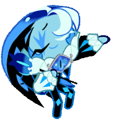

  

    
    

        
        

    

    
    

<table align="center">
  <tr>
    <td align="center">
      $\color{#def5ff}{\normalsize{\texttt{hello (˶˃𐃷˂˶) !! feel free to c+h anytime!}}}$  
        
      $\color{#def5ff}{\normalsize{\texttt{ask to take inspo on my skins/layout,}}}$  
      $\color{#def5ff}{\normalsize{\texttt{dnc please (╥﹏╥) !! iwc at all costs}}}$  
      $\color{#def5ff}{\normalsize{\texttt{ask to match please (˶˃ᆺ˂˶)}}}$  
    </td>
  </tr>
</table>

  
  
  

  
  
  

<table align="center">
  <tr>
    <td align="center">
      $\color{#9ce0ff}{\large{\texttt{✧ DNI ✧}}}$  
      $\color{#def5ff}{\normalsize{\texttt{basic dni criteria, femcels/incels}}}$  
      $\color{#def5ff}{\normalsize{\texttt{misogynists AND misandrists, people with a WPD account,}}}$  
      $\color{#def5ff}{\normalsize{\texttt{silentshadow/burningshadow (ONLY THE ROLEPLAYERS/RPS,}}}$  
      $\color{#def5ff}{\normalsize{\texttt{shippers int freely but please dont try rping the ship with me.),}}}$  
      $\color{#def5ff}{\normalsize{\texttt{hazbin/helluva fans (no exceptions).}}}$  
    </td>
  </tr>
</table>
<table align="center">
  <tr>
    <td align="center">
      $\color{#9ce0ff}{\large{\texttt{✧ IWC ✧}}}$  
      $\color{#def5ff}{\normalsize{\texttt{hetalia/countryhuman fans, cutegore people, people}}}$  
      $\color{#def5ff}{\normalsize{\texttt{with touch discomfort/trigger, people over 18,}}}$  
      $\color{#def5ff}{\normalsize{\texttt{dark romance/yandere haters and}}}$  
      $\color{#def5ff}{\normalsize{\texttt{people with dark humour (you can joke with me but dont go too far.)}}}$  
      

  

    </td>
  </tr>
</table>

    
    

  
  
  
  
  
  

  

